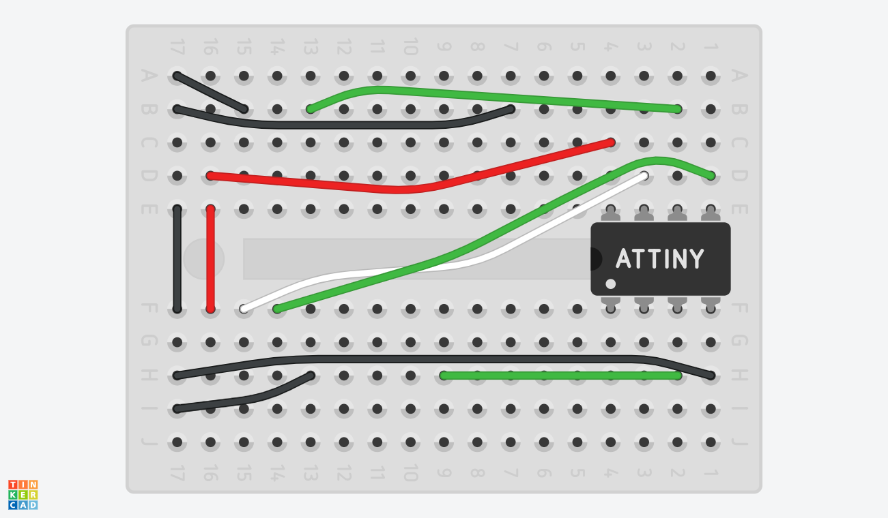
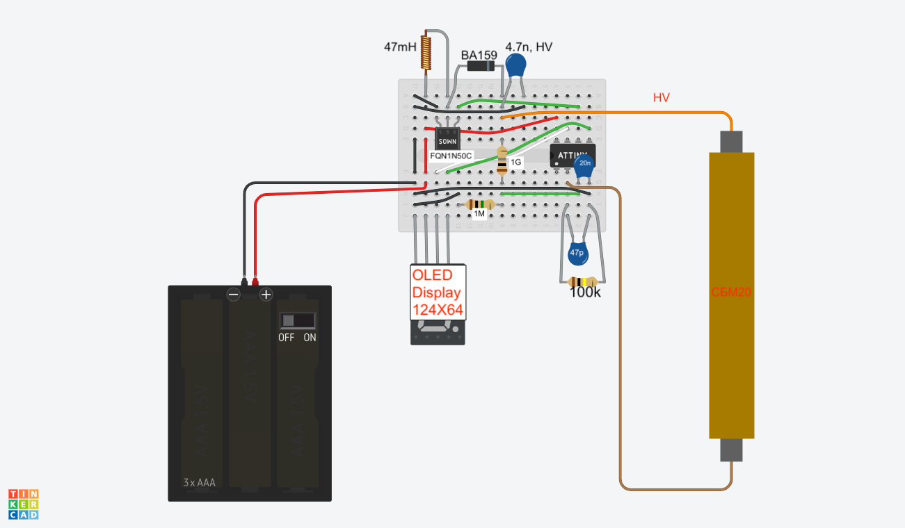

# GeigerTINY

This repo describes an even simpler Geiger design to the arduino based one we described [ealier](https://github.com/ustajan/Geiger_lanph), using just nine analog components, all operated by an ATTINY85 microcontroller.

## Design

The design consists of a

 + basic boost converter consisting of an inductor, HV diode, a HV MOSFET, and a HV capacitor
 + the MOSFET is triggered by a square pulse from attiny85
 + the resulting voltage is read back through a 1/1000 voltage divider back into attiny85.  The microcontroller compares the resulting voltage to a desired HV window, and adjust the duty to achieve a HV in that window
 + the HV is connected to the + terminal of the SBM-20 Geiger-Muller tube
 + the - terminal of SBM-20 is sent to ground through a 100k resistor, and is read directly into the attiny85.  This is sufficient to trigger the microcontroller
 + attiny85 displays the results on a 128X64 OLED display

## Description and basic assembly instructions

Given the simplicity of the design we only provide a photo and a basic schematic of the layout.  

### Building the device
We suggest that you start by taking a (170 point) mini-breadboard and first put the various interconnects with wires. The colors of the wires of course don't matter, however picking the right color code will help you later greatly in your debugging. The "ATTINY" chip is the attiny85.

Once you are done with the wiring, you can finally populate the breadboard with the nine analog components as below.  Add the battery connection, the OLED, and the SBM-20 connections last. The HV line (brown) goes to the + terminal of SBM-20, of course.

## Adding the code to attiny85
The code for the microcontroller is located in<code>geiger\_attiny85\_bitbang</code>.  See the header of the code for a detailed description.

Loading the code onto the microcontroller is not a trivial task.  There are a number of online instructions on how to use an Arduino to program attiny85.  [Here's a great one](https://www.youtube.com/watch?v=Z_MhVSlMZI8): for that you'll need a common Arduino (e.g. Arduino UNO), a small breadboard, a bunch of wires, and a willingness to follow the instructions provided in the video.  
#### Dependencies
Your arduino code will require you to get <code>Tiny4kOLED\_bitbang.h</code> library from [here](https://github.com/datacute/Tiny4kOLED/blob/master/src/Tiny4kOLED_bitbang.h) or via the Arduino IDE.

## Bugs

There are a few known issues:

 + at high rates the devices tends to freeze, and the OLED shows corrupted imagery.  This is likely due to some array overrun in the microcontroller's code.

## Components
See the <code>Bill\_of_Materials.xlsx</code> for a complete list of materials, cost estimates, as well as links to digikey and Amazon for quick ordering.

